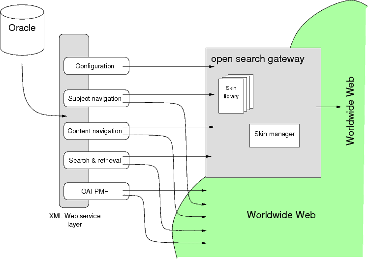

[READ ME](README.md) - [Dissemination](oai-pmh.md) - [Web services in COP](cop-backend.md) - [Aerial Photography](geographic-data.md) - [Image delivery](image-delivery.md) - [Metadata Formats](metadata-formats.md) - [Text Corpora](text-corpora.md)

# Web services in COP

## Web service architecture



## Syndication service formats

The syndication service is made for search and retrieval. By default it
delivers a search result set (or a search for a record ID) in [rss
2.0](https://cyber.harvard.edu/rss/rss.html).  The syndication service
supports some  mods and kml as well. You can "toggle" between the formats using the `format` CGI
parameter.

| format | root element |
|:-------|:-------------|
| rss    | ```<rss> ... </rss>```|
| mods   | ```<modsCollection> ... </modsCollection>``` |
| kml    | ```<kml> ... </kml>``` |

The formats rss and kml are used internally in our services. All search and retrieval in 
[Digital Editions - COP](http://www.kb.dk/editions/any/2009/jul/editions/en/)
is based on the former, the latter is tranlated to ```json``` and is then used in the
client side rendering of maps [DSFL](http://www.kb.dk/danmarksetfraluften/) (DFSL)

Note that mods records are embedded in the rss.

## Open Search

Clients communicates with the server with Amazon A9.com [Open
search](http://www.opensearch.org/Home) protocol.

All formats supported include a Open search header (used for
resultset navigation) at the very beginning of each result set:

```
<startIndex xmlns="http://a9.com/-/spec/opensearch/1.1/">1</startIndex>
<itemsPerPage xmlns="http://a9.com/-/spec/opensearch/1.1/">40</itemsPerPage>
<Query xmlns="http://a9.com/-/spec/opensearch/1.1/" role="request" searchTerms="{}" startPage="1"/>
<totalResults xmlns="http://a9.com/-/spec/opensearch/1.1/">104820</totalResults>
<link xmlns="http://www.w3.org/2005/Atom" 
      href="http://www.kb.dk/cop/images/billed/2010/okt/billeder" 
      rel="search" 
      type="application/opensearchdescription+xml"/>
<link xmlns="http://www.w3.org/2005/Atom" href="http://www.kb.dk/cop/syndication/images/billed/2010/okt/billeder/" 
      rel="search" 
      type="application/rss+xml"/>
```

This search result starts with record 1 out of 104820, you obtain them in chunks of 40
items. You can adjust your retrieval using the `page` and `itemsPerPage` [CGI variables](cop-backend.md#query-parameters-in-cop)

## Examples

+ search "by subject", searching by navigation -- examples
  + http://www.kb.dk/cop/syndication/images/billed/2010/okt/billeder/en/?page=1&subject=2120&itemsPerPage=40
    which is synonymous with
  + http://www.kb.dk/cop/syndication/images/billed/2010/okt/billeder/subject2120/en/?page=1 
    The result set can be further molded by the itemsPerPage parameter. For example
  + http://www.kb.dk/cop/syndication/images/billed/2010/okt/billeder/subject2109/en/?itemsPerPage=5
    if you need page 4 in the result set add that to the `URI`
  + http://www.kb.dk/cop/syndication/images/billed/2010/okt/billeder/subject2109/en/?itemsPerPage=5&page=4
+ search "by querying", ordinary search -- for example
  http://www.kb.dk/cop/syndication/images/billed/2010/okt/billeder/en/?page=2&query=jesus&itemsPerPage=40

To see what is going on in these examples, you have to view source, or
you just see how your browser renders RSS. If you're using a computer
supporting a unix command line, such as Mac and Linux it is actually
easier to use the `xmllint` command:

`xmllint --format` "http://www.kb.dk/cop/syndication/images/billed/2010/okt/billeder/subject2109/en/?itemsPerPage=5&page=4"

Don't forget the quotation marks around the URI, or your shell will
try to do clever things with the meta-characters (?& etc). The format
option ensures that the retrieved document is nicely indented and
pretty-printed.

## Query parameters in COP 

Complete list of supported parameters in COP 

| Parameter | Use in PATH | Use in CGI | Comment | Status|
|-----------|:-------------|:------------|:--------|-------|
|query | - | supported | Synonym to q | ok |
|format | - | supported | kml, rss and mods | ok |
|page | - | supported | | ok |
|itemsPerPage | - | supported | |ok |
|object | supported | - | | ok |
|subject | supported | deprecated | Synonym to categories | ok |
|bbo | - | supported | Bounding Box |
|notBefore | - | supported | Not before a given date | - |
|notAfter | - | supported | Not after a given date | - |

Field candidates, mostly geographical ones

| Parameter | Used in PATH | Used in CGI | Comment | Status|
|-----------|:-------------|:------------|:--------|-------|
|title | - | supported |||
|person | - | supported |||
|building | - | supported |||
|parish | - | supported |||
|street | - | supported |||
|housenumber | - | supported |||
|zipcode | - | supported |||
|cadastre | - | supported |||
|area | - | supported |||
|city | - | supported |||
|location | - | supported |||
|note | - | supported |||
|orientation | - | supported |||

We have more [detailed information on geographical searching](geographic-data.md).

## Navigation service

The subject hierarchy needed for filtering and for building the
browsing service can be retrieved from the navigation service. Links
to RSS & HTML representations of the data -- ex

http://www.kb.dk/cop/navigation/images/billed/2010/okt/billeder/subject841/

Here note that you get all nodes in the subject tree down to _kirker
og kirkegårde_, i.e., a complete bread crumb path: 

_Billeder_ - _Samlinger_ - _Fotografarkiver_ - _Türck, Sven_ - _arkitektur_

Architecture is the parent of _kirker og kirkegårde_

```
<outline htmlUrl="http://www.kb.dk/images/billed/2010/okt/billeder/subject841/"
	 id="841" 
	 nodeId="841" 
	 text="kirker og kirkegårde" 
	 url="http://www.kb.dk/cop/navigation/images/billed/2010/okt/billeder/subject841/" 
	 xmlUrl="http://www.kb.dk/cop/syndication/images/billed/2010/okt/billeder/subject841/">
	 <outline htmlUrl="http://www.kb.dk/images/billed/2010/okt/billeder/subject1035/"
	          id="1035" 
		  nodeId="1035" 
		  text="grave" 
		  url="http://www.kb.dk/cop/navigation/images/billed/2010/okt/billeder/subject1035/" 
		  xmlUrl="http://www.kb.dk/cop/syndication/images/billed/2010/okt/billeder/subject1035/"/>
         <outline htmlUrl="http://www.kb.dk/images/billed/2010/okt/billeder/subject1036/" 
	 	  id="1036" 
		  nodeId="1036" 
		  text="gravsten" 
		  url="http://www.kb.dk/cop/navigation/images/billed/2010/okt/billeder/subject1036/" 
		  xmlUrl="http://www.kb.dk/cop/syndication/images/billed/2010/okt/billeder/subject1036/"/>
         <outline htmlUrl="http://www.kb.dk/images/billed/2010/okt/billeder/subject1264/" 
	          id="1264" 
		  nodeId="1264" 
		  text="rundkirker" 
		  url="http://www.kb.dk/cop/navigation/images/billed/2010/okt/billeder/subject1264/"
		  xmlUrl="http://www.kb.dk/cop/syndication/images/billed/2010/okt/billeder/subject1264/"/>
         </outline>
</outline>
```

Each node contains The subjects name in Danish or when applicable also English, such as for the following one:

http://www.kb.dk/cop/navigation/manus/ortsam/2009/okt/orientalia/subject637/en/

where there is `text-en` in addition to `text`. For each `outline` we
get three `URI` attributes: htmlUrl, url and xmlUrl. They point to the
content of a subject, the navigation info for that subject and finally
the corresponding syndication services. Hence, considering the
`outline` with subject 1036 above well get:

+ Its subject tree: http://www.kb.dk/cop/navigation/images/billed/2010/okt/billeder/subject1036/
+ Its syndication feed: http://www.kb.dk/cop/syndication/images/billed/2010/okt/billeder/subject1036/
+ And finally, if you append a language, for example, `en/` as in English to the htmlUrl http://www.kb.dk/images/billed/2010/okt/billeder/subject1036/en/ a the search result in HTML for gravsten (i.e., tomb stone) with user interface in English.

## Content service 

A majority of the digital objects in COP are "complex" in one way or
another. By that we understand that we need to see more than one file
to consume the entire object. The simplest case is a photograph
requiring a digital image of each side, where there are essential
information on the back. This means that we need a table of
contents (TOC) for every digital object in the service, and that TOC
is delivered through the content service.

Here is one for a fairly complex song book

http://www.kb.dk/cop/content/manus/musman/2010/dec/viser/object23942/en/

and one for two page letter

http://www.kb.dk/cop/content/letters/judsam/2011/mar/dsa/object10/en/

respectively.

Typically they look like:

```
<outline htmlUrl="online_master_arkiv_5/non-archival/Manus/VMANUS/2009/jun/dfs_1906_6a_16/dfs_1906_6a_16_001.tif" 
	 n="1" 
	 sequence="1" 
	 text="Chresten Jensens Visebog" 
	 xml:lang="da">
   <outline htmlUrl="online_master_arkiv_5/non-archival/Manus/VMANUS/2009/jun/dfs_1906_6a_16/dfs_1906_6a_16_002.tif" n="2" sequence="2"/>
   <outline htmlUrl="online_master_arkiv_5/non-archival/Manus/VMANUS/2009/jun/dfs_1906_6a_16/dfs_1906_6a_16_003.tif" 
            n="3" sequence="3" text="01 Held Danmarks gamle rige" xml:lang="da"/>
   <outline htmlUrl="online_master_arkiv_5/non-archival/Manus/VMANUS/2009/jun/dfs_1906_6a_16/dfs_1906_6a_16_004.tif" n="4" sequence="4">
      <outline htmlUrl="online_master_arkiv_5/non-archival/Manus/VMANUS/2009/jun/dfs_1906_6a_16/dfs_1906_6a_16_005.tif" n="5"
               sequence="5" text="02 Frivillige møder vi" xml:lang="da"/>
   </outline>
   <outline htmlUrl="online_master_arkiv_5/non-archival/Manus/VMANUS/2009/jun/dfs_1906_6a_16/dfs_1906_6a_16_006.tif" n="6" sequence="6" 
            text="03 Jeg kan tænke, tiden er dig lang" xml:lang="da">
       <outline htmlUrl="online_master_arkiv_5/non-archival/Manus/VMANUS/2009/jun/dfs_1906_6a_16/dfs_1906_6a_16_007.tif" n="7" sequence="7"/>
   </outline>
   <outline htmlUrl="online_master_arkiv_5/non-archival/Manus/VMANUS/2009/jun/dfs_1906_6a_16/dfs_1906_6a_16_008.tif" n="8" 
            sequence="8" text="04 Kom, gode folk" xml:lang="da"/>

...

```

The nesting of outline elements seems to be dependent on some oddities
in the authoring tool. In order to read the book, you'll have to
retrieve the images. The construction of [image URIs is described elsewhere](image-delivery.md). 


